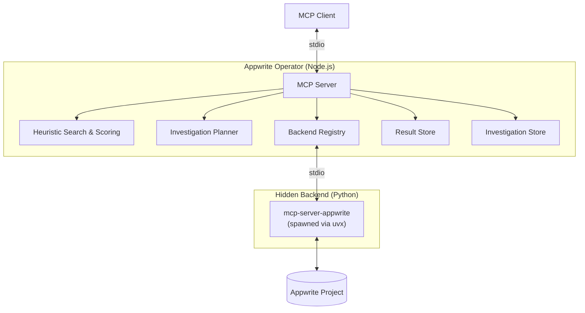
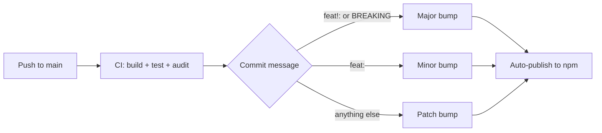

# Contributing to Appwrite Operator

## Development

```bash
# Install
npm ci

# Build
npm run build

# Type-check without emitting
npm run check

# Run all tests
npm test

# Run in dev mode (tsx, no build step)
npm run dev

# Start the compiled server
npm start
```

## Architecture



| Component | File | Purpose |
|---|---|---|
| Server | `src/server.ts` | Tool/resource registration, request handling |
| Backend Registry | `src/backend.ts` | Backend lifecycle, catalog caching, tool dispatch |
| Heuristics | `src/heuristics.ts` | Tool name parsing, fuzzy search, scoring |
| Planner | `src/planner.ts` | Investigation planning (sampling + heuristic fallback) |
| Config | `src/config.ts` | Config file parsing, env resolution |
| Result Store | `src/resultStore.ts` | Server-side storage for large tool results |
| Investigation Store | `src/investigationStore.ts` | Server-side storage for investigation transcripts |
| Types | `src/types.ts` | Shared type definitions |

## Tool Annotations

The operator sets [MCP ToolAnnotations](https://modelcontextprotocol.io/specification/2025-03-26/server/tools#toolannotations) so clients can distinguish read-only tools from write-capable tools:

| Tool | readOnlyHint | destructiveHint |
|---|---|---|
| `appwrite_list_backends` | `true` | — |
| `appwrite_search_tools` | `true` | — |
| `appwrite_call_tool` | — | `true` |
| `appwrite_investigate` | `true` | — |

## Publishing to npm

If you fork or modify this project and want to publish your own version:

```bash
# 1. Update the "name" field in package.json to your package name
# 2. Log in to npm
npm login

# 3. Publish (the prepublishOnly script builds automatically)
npm publish --access public
```

## CI / CD



| Workflow | Trigger | Purpose |
|---|---|---|
| [ci.yml](.github/workflows/ci.yml) | Every PR and push to `main` | Type-check, build, tests (Node 20 + 22), `npm audit` |
| [publish.yml](.github/workflows/publish.yml) | Push to `main` | Auto-determine version via [conventional commits](https://www.conventionalcommits.org/), create tag + GitHub Release, publish to npm with provenance |
| [dependabot.yml](.github/dependabot.yml) | Weekly + immediate for vulnerabilities | Opens PRs for dependency updates |
| [auto-merge-dependabot.yml](.github/workflows/auto-merge-dependabot.yml) | Dependabot PRs | Auto-approves and squash-merges patch/minor updates. Major bumps need manual review. |

### Version Bumping

Version is determined automatically from commit messages since the last tag:

- `feat!:` or `BREAKING CHANGE` → **major** bump
- `feat:` → **minor** bump
- Anything else (`fix:`, `chore:`, etc.) → **patch** bump

### One-Time Setup

1. **Add `NPM_TOKEN` secret** — [npmjs.com](https://www.npmjs.com) → Access Tokens → Generate (Automation) → copy → GitHub repo Settings → Secrets → Actions → `NPM_TOKEN`
2. **Enable auto-merge** — GitHub repo Settings → General → Pull Requests → "Allow auto-merge"
3. **Branch protection on `main`** — Settings → Branches → Add rule → require `build-and-test` status check
