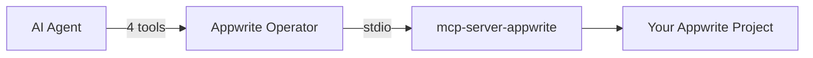
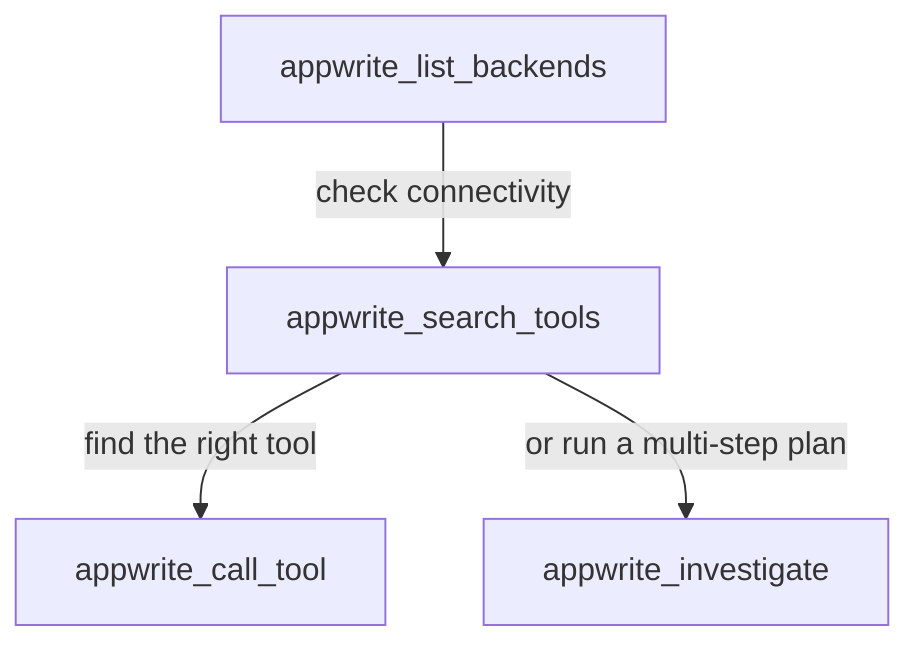

# Appwrite Operator MCP

> ## ⚠️ DEPRECATED
>
> **This package is no longer maintained.** As of [`mcp-server-appwrite` v0.4.1](https://pypi.org/project/mcp-server-appwrite/) (April 2026), the official Appwrite MCP server now includes built-in operator-style functionality — adopting the architecture this project pioneered:
>
> - Only 2 tools exposed to the model (`appwrite_search_tools`, `appwrite_call_tool`)
> - Full Appwrite tool catalog stays internal and is searched at runtime
> - Large outputs stored as MCP resources
> - Mutating tools require `confirm_write=true`
>
> **Use the official server directly:**
>
> ```
> uvx mcp-server-appwrite
> ```
>
> See the [official docs](https://pypi.org/project/mcp-server-appwrite/) for configuration.

---

<details>
<summary>Original README (archived)</summary>

[](https://github.com/sgaabdu4/appwrite-operator/actions/workflows/ci.yml)
[](https://www.npmjs.com/package/appwrite-operator-mcp)
[](LICENSE)

An MCP server that wraps the official [mcp-server-appwrite](https://github.com/appwrite/mcp-for-api) behind **4 smart tools** instead of exposing hundreds of raw Appwrite tools directly to your AI agent.

> **New to MCP?** [Model Context Protocol](https://modelcontextprotocol.io) is an open standard that lets AI assistants (Claude, Copilot, Cursor, etc.) call external tools. An MCP server is a small program that exposes those tools. This project is an MCP server for [Appwrite](https://appwrite.io) — an open-source backend-as-a-service platform.

## The Problem

The official `mcp-server-appwrite` registers **one tool per Appwrite API endpoint** — databases, storage, users, functions, messaging, teams, and more. That is a lot of tools. Most AI agents struggle with this because:

- **Tool overload.** Hundreds of tools flood the model's context and slow down tool selection.
- **Context bloat.** Each tool call returns verbose JSON that eats up the context window.
- **No guardrails.** Every tool is writable by default — one wrong call can delete a database.

## How the Operator Fixes This



The operator sits between your AI agent and the raw Appwrite backend:

1. **4 public tools** replace hundreds. The AI searches, calls, and investigates through a small, focused surface.
2. **Large results stay out of context.** Full responses are stored server-side and exposed as MCP Resources. The AI gets a short preview + a resource link it can fetch only when needed.
3. **Write protection.** Non-read-only tools require an explicit `confirmWrite: true` flag — the AI cannot accidentally mutate your data.
4. **Smart search.** Fuzzy, scored tool search with camelCase splitting, verb detection, and service filtering finds the right hidden tool fast.

## Prerequisites

You need these installed on your machine before starting:

| Requirement | Version | Install command | Why |
|---|---|---|---|
| **Node.js** | 20+ | [nodejs.org/download](https://nodejs.org/en/download) | Runs the operator server |
| **Python** | 3.10+ | [python.org/downloads](https://www.python.org/downloads/) | Required by `uvx` |
| **uv** (includes uvx) | latest | `curl -LsSf https://astral.sh/uv/install.sh \| sh` | Runs the hidden Appwrite backend |
| **Appwrite project** | any | [appwrite.io](https://appwrite.io) or self-hosted | You need a project ID, API key, and endpoint URL |

> **How to get your Appwrite credentials:**
> 1. Go to your Appwrite console → **Settings** → copy your **Project ID**
> 2. Go to **Settings** → **API Keys** → create a key with the scopes you need → copy the **API Key**
> 3. Your **Endpoint** is `https://cloud.appwrite.io/v1` for Appwrite Cloud, or `https://your-domain/v1` for self-hosted

## Quick Start

### Step 1: Clone and build

```bash
git clone https://github.com/sgaabdu4/appwrite-operator.git
cd appwrite-operator
npm install
npm run build
```

### Step 2: Run the tests (optional)

```bash
npm test
```

### Step 3: Add to your MCP client

Pick one of the setups below depending on your client.

## Setup

### Option A: npx — Zero Install (Recommended)

No cloning, no building. Your MCP client downloads and runs the operator automatically.

> **Note:** You still need Node.js 20+ and uv installed on your machine (see [Prerequisites](#prerequisites)).

**Claude Desktop** — add to `claude_desktop_config.json` (find it via Claude Desktop → Settings → Developer → Edit Config):

```json
{
  "mcpServers": {
    "appwrite-operator": {
      "command": "npx",
      "args": ["-y", "appwrite-operator-mcp"],
      "env": {
        "APPWRITE_PROJECT_ID": "your-project-id",
        "APPWRITE_API_KEY": "your-api-key",
        "APPWRITE_ENDPOINT": "https://cloud.appwrite.io/v1"
      }
    }
  }
}
```

**VS Code** — add to `.vscode/mcp.json` in your workspace, or open Command Palette → `MCP: Open User Configuration`:

```json
{
  "servers": {
    "appwrite-operator": {
      "command": "npx",
      "args": ["-y", "appwrite-operator-mcp"],
      "env": {
        "APPWRITE_PROJECT_ID": "your-project-id",
        "APPWRITE_API_KEY": "your-api-key",
        "APPWRITE_ENDPOINT": "https://cloud.appwrite.io/v1"
      }
    }
  }
}
```

**Cursor** — add to Cursor Settings → MCP → Add Server:

```json
{
  "mcpServers": {
    "appwrite-operator": {
      "command": "npx",
      "args": ["-y", "appwrite-operator-mcp"],
      "env": {
        "APPWRITE_PROJECT_ID": "your-project-id",
        "APPWRITE_API_KEY": "your-api-key",
        "APPWRITE_ENDPOINT": "https://cloud.appwrite.io/v1"
      }
    }
  }
}
```

Replace `your-project-id`, `your-api-key`, and `https://cloud.appwrite.io/v1` with your actual Appwrite credentials. The operator spawns `uvx mcp-server-appwrite` automatically.

### Option B: Clone and Build (Local Development)

If you want to modify the operator or run from source:

```bash
git clone https://github.com/sgaabdu4/appwrite-operator.git
cd appwrite-operator
npm install
npm run build
```

Then use `node` instead of `npx` in your MCP client config:

```json
{
  "command": "node",
  "args": ["/absolute/path/to/appwrite-operator/build/src/index.js"],
  "env": {
    "APPWRITE_PROJECT_ID": "your-project-id",
    "APPWRITE_API_KEY": "your-api-key",
    "APPWRITE_ENDPOINT": "https://cloud.appwrite.io/v1"
  }
}
```

### Option C: Config File (Multiple Backends)

For advanced setups with multiple Appwrite projects or custom backend commands, create a config file:

**`appwrite-operator.config.json`**:

```json
{
  "backends": [
    {
      "id": "production",
      "label": "Production",
      "command": "uvx",
      "args": ["--with", "appwrite<16.0.0", "mcp-server-appwrite"],
      "env": {
        "APPWRITE_PROJECT_ID": "${PROD_PROJECT_ID}",
        "APPWRITE_API_KEY": "${PROD_API_KEY}",
        "APPWRITE_ENDPOINT": "${PROD_ENDPOINT}"
      }
    },
    {
      "id": "staging",
      "label": "Staging",
      "command": "uvx",
      "args": ["--with", "appwrite<16.0.0", "mcp-server-appwrite"],
      "env": {
        "APPWRITE_PROJECT_ID": "${STAGING_PROJECT_ID}",
        "APPWRITE_API_KEY": "${STAGING_API_KEY}",
        "APPWRITE_ENDPOINT": "${STAGING_ENDPOINT}"
      }
    }
  ]
}
```

**`.env`** (values for `${...}` placeholders above):

```
PROD_PROJECT_ID=abc123
PROD_API_KEY=secret-key-here
PROD_ENDPOINT=https://cloud.appwrite.io/v1
STAGING_PROJECT_ID=xyz789
STAGING_API_KEY=staging-key-here
STAGING_ENDPOINT=https://staging.appwrite.io/v1
```

Then point the operator at these files via environment variables:

```json
{
  "mcpServers": {
    "appwrite-operator": {
      "command": "npx",
      "args": ["-y", "appwrite-operator-mcp"],
      "env": {
        "APPWRITE_OPERATOR_CONFIG": "/absolute/path/to/appwrite-operator.config.json",
        "APPWRITE_OPERATOR_ENV": "/absolute/path/to/.env"
      }
    }
  }
}
```

## Tools

The operator exposes 4 tools. Your AI agent uses them in this workflow:



### `appwrite_list_backends`

List configured Appwrite backends and their connection status.

| Parameter | Type | Default | Description |
|---|---|---|---|
| `refresh` | boolean | `false` | Reconnect and refresh the tool catalog |

**Example response:**
```
- production (Production), connected, tools=422, 14 services
```

### `appwrite_search_tools`

Search the hidden Appwrite tool catalog by natural language query. Returns scored matches with resource links to the full catalog.

| Parameter | Type | Default | Description |
|---|---|---|---|
| `query` | string | *required* | What you're looking for (e.g. `"list databases"`) |
| `serviceHints` | string or string[] | — | Filter by service (e.g. `"tablesdb"`, `"storage"`) |
| `argumentHints` | object | — | Known arguments to boost tools that accept them |
| `includeMutating` | boolean | `false` | Include write/delete tools in results |
| `backendIds` | string[] | — | Limit search to specific backends |
| `limit` | number | 6 | Max results to return |

**Example response:**
```
1. [98] tablesdb_list_rows (production) — read
   List rows from a TablesDB table.
   Required: databaseId, collectionId
```

### `appwrite_call_tool`

Call a specific hidden Appwrite tool by name. Pass tool parameters in the `arguments` field.

| Parameter | Type | Default | Description |
|---|---|---|---|
| `toolName` | string | *required* | Exact tool name from search results |
| `backendId` | string | *required* | Which backend to call |
| `arguments` | object or JSON string | `{}` | Parameters for the Appwrite tool |
| `confirmWrite` | boolean | `false` | **Must be `true`** for non-read-only tools |

**Write protection:** If the tool is classified as `write`, `delete`, or `unknown` and `confirmWrite` is not `true`, the call is blocked with an error message.

**Large results:** When a response exceeds 800 characters, the AI gets a short preview and a resource link (`operator://results/{id}`) to fetch the full result on demand. This keeps the context window clean.

### `appwrite_investigate`

Plan and run a bounded, read-only investigation across your Appwrite project. The operator builds a multi-step plan, executes each step, and returns a summary.

| Parameter | Type | Default | Description |
|---|---|---|---|
| `goal` | string | *required* | What to investigate (e.g. `"find all collections with more than 1000 documents"`) |
| `argumentHints` | object | — | Known values (e.g. `{"databaseId": "main"}`) |
| `serviceHints` | string[] | — | Limit to specific services |
| `backendIds` | string[] | — | Limit to specific backends |
| `maxSteps` | number (1–12) | 4 | Maximum investigation steps |

**How planning works:** If your MCP client supports [sampling](https://spec.modelcontextprotocol.io/specification/2025-03-26/client/sampling/), the operator asks the AI to build an optimal plan. Otherwise, it falls back to deterministic heuristic planning (fuzzy search + verb detection + argument matching).

## Resources

The operator exposes 3 MCP resources that keep large data **out of the AI's context** until it actually needs it:

| URI Pattern | Description |
|---|---|
| `operator://catalog/{backendId}` | Full hidden tool catalog for a backend (JSON) |
| `operator://investigations/{id}` | Complete investigation transcript (JSON) |
| `operator://results/{id}` | Full tool call result text |

These are returned as `resource_link` references in tool responses. The AI fetches them only when it needs the full data.

## Contributing

See [CONTRIBUTING.md](CONTRIBUTING.md) for development setup, architecture, and release process.

## Troubleshooting

**"No Appwrite backends configured"**
→ Check that `APPWRITE_PROJECT_ID`, `APPWRITE_API_KEY`, and `APPWRITE_ENDPOINT` are set in your MCP client config, or that `APPWRITE_OPERATOR_CONFIG` points to a valid config file.

**"Backend failed to connect"**
→ Make sure `uvx` is installed and accessible from your `PATH`. Run `uvx mcp-server-appwrite --help` to verify.

**"Write blocked" error on `appwrite_call_tool`**
→ The tool is classified as a write/delete operation. Add `confirmWrite: true` to allow it.

**Large responses seem truncated**
→ The operator returns a preview (first 800 chars) and a resource link. Your MCP client should fetch the full result via `operator://results/{id}`.

## License

MIT

</details>
